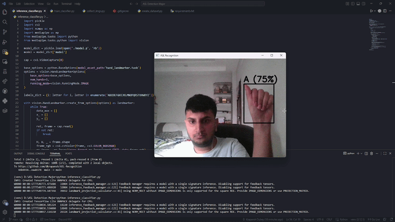

# Sign-Sense — Real-Time ASL Alphabet Recognition

A real-time American Sign Language (ASL) alphabet recognition system built with MediaPipe, OpenCV, and scikit-learn. Recognizes all 26 ASL hand signs from live webcam input with per-prediction confidence scoring.



---

## What it does

- Detects your hand in real time using your webcam
- Extracts 21 hand landmarks per frame using MediaPipe's Hand Landmarker
- Classifies the gesture into one of 26 ASL alphabet letters using a Random Forest classifier
- Displays the predicted letter and confidence percentage live on screen
- Shows `?` when confidence falls below 60% instead of making a wrong prediction

---

## Why this architecture

The core design decision was to not do image classification. Instead of feeding raw pixels into a CNN, we extract 21 normalized 3D hand landmarks from MediaPipe and classify those geometric features directly.

This matters because:
- CNNs trained on raw pixels are sensitive to lighting, skin tone, and background. Landmark features are not.
- 42 normalized coordinates per frame is a compact, interpretable feature space that Random Forest handles efficiently
- Inference runs in real time on CPU with no GPU dependency
- The feature engineering step (scale normalization via bounding box) ensures the model is invariant to hand distance from camera

---

## Project structure
├── collect_imgs.py        # Webcam-based data collection for all 26 classes
├── create_dataset.py      # MediaPipe landmark extraction + feature engineering pipeline
├── train_classifier.py    # Model training with cross-validation and per-class evaluation
├── inference_classifier.py # Real-time inference with confidence thresholding
├── hand_landmarker.task   # MediaPipe Hand Landmarker model
├── model.p                # Trained Random Forest classifier
├── data.pickle            # Processed landmark dataset
└── requirements.txt
---

## How to run

**1. Clone the repo**
```bash
git clone https://github.com/dkrapansh/ASL-Recognition
cd ASL-Recognition
```

**2. Create a virtual environment (Python 3.12 required)**
```bash
py -3.12 -m venv venv
venv\Scripts\activate      # Windows
source venv/bin/activate   # Mac/Linux
```

**3. Install dependencies**
```bash
pip install -r requirements.txt
```

**4. Collect your own data (optional — model.p is included)**
```bash
python collect_imgs.py
python create_dataset.py
python train_classifier.py
```

**5. Run inference**
```bash
python inference_classifier.py
```
Press `q` to quit.

---

## Model performance

| Metric | Score |
|--------|-------|
| Test Accuracy | 100% (controlled conditions) |
| Cross-Validated Accuracy (5-fold) | 99.81% ± 0.38% |
| Classes | 26 (full ASL alphabet) |
| Training samples | 2,600 (100 per class) |
| Features per sample | 42 (21 landmarks × x, y) |

**Honest caveat:** Training data was collected in a single session under consistent lighting and background. Real-world accuracy is lower with varied conditions. The right next step is data augmentation with brightness, contrast, and background variation.

---

## Known limitations and next steps

- Single-session training data limits generalization across users and lighting conditions
- Data augmentation (brightness, contrast, background variation) would improve robustness
- Word composition from individual letters is a natural next feature
- Model is currently trained on one hand orientation — multi-user support would require diverse data collection

---

## Tech stack

- Python 3.12
- MediaPipe Tasks API (Hand Landmarker)
- OpenCV
- scikit-learn (Random Forest)
- NumPy